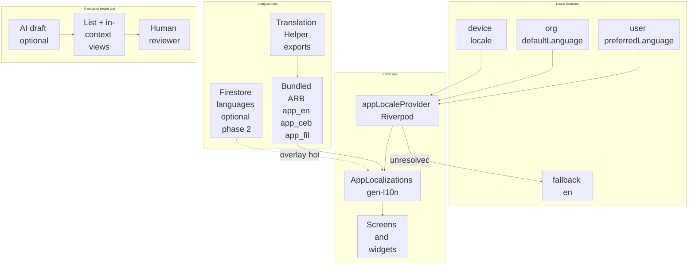
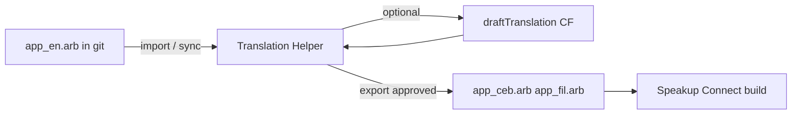
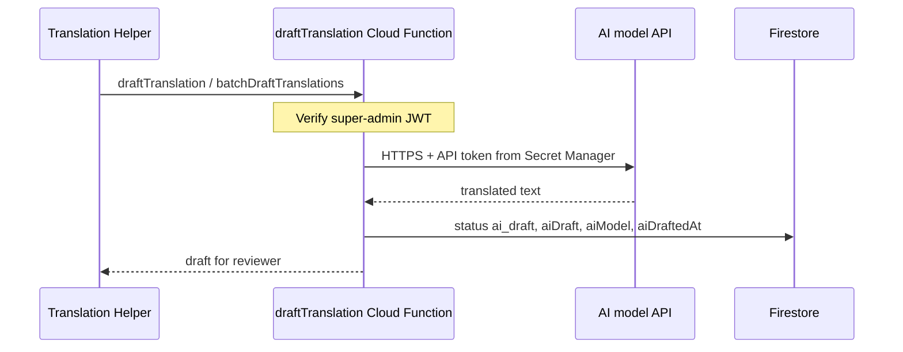

# Internationalization (i18n) — Architecture

> **Status:** Phase 1 + 1b shipped — `app_en.arb` / `app_ceb.arb` (English placeholders), Home + Settings language pickers, locale-aware help, `kLanguageNativeLabels`  
> **Priority:** High — see language rollout table below  
> **Epic:** [MASTER_TASK_LIST.md → Epic 2.5](MASTER_TASK_LIST.md)  
> **Related:** [DATABASE_DESIGN.md](DATABASE_DESIGN.md), [ARCHITECTURE.md](ARCHITECTURE.md), [RBAC_ARCHITECTURE.md](RBAC_ARCHITECTURE.md)

SpeakUp Connect serves Philippine schools where students and parents use **US English**, **Tagalog**, **Bisaya (Cebuano)**, and other regional languages. This document defines how UI translation works before implementation begins.

---

## 1. Goals and non-goals

### Goals

1. **US English (`en`, `en_US`)** is the **home language** — canonical source for every string key, developer authoring, and fallback when a translation is missing.
2. **Tagalog (`fil`)** is the **second platform language** (nationwide).
3. **Bisaya / Cebuano (`ceb`)** is the **first regional translation** — prioritized for MONHS and Visayas/Mindanao pilots (may ship before Tagalog is 100% complete).
4. User can switch language on **Home** (prominent globe dropdown) and in **Settings → Appearance → Language**.
5. Choice persists **locally** (fast cold start) and syncs to **`users/{uid}.preferredLanguage`**.
6. Org admins can set **`defaultLanguage`** and **`supportedLanguages`** on the org document.
7. App works **offline** with bundled translations (no network required to render UI).
8. A **Translation Helper** tool (web or admin app) lets human interpreters work in context or in a list, with **optional AI-generated first drafts**.
9. Additional languages (Hiligaynon, Ilocano, etc.) use the same ARB + Translation Helper pipeline.

### Language rollout order

| Order | Code | Language | Scope |
|-------|------|----------|--------|
| **Home** | `en` | **US English** | Source of truth; `app_en.arb`; `Locale('en', 'US')` |
| **1st add-on** | `ceb` | **Bisaya / Cebuano** | MONHS / Visayas–Mindanao pilots |
| **2nd** | `fil` | **Tagalog** | Platform-wide second language |
| **3rd+** | … | Hiligaynon, Ilocano, etc. | Via Translation Helper as schools expand |

MONHS may enable `ceb` in the app before Tagalog strings are fully reviewed; both ARB files ship in the same codebase when ready.

### Non-goals (v1)

- Translating **user-generated content** (announcements, reminders, report descriptions) — authors write in their own language.
- **Runtime** machine translation in the member app (users always see pre-reviewed bundled strings).
- Per-org custom UI string overrides (consider later via Firestore overlay).
- RTL layouts (not required for planned languages).

---

## 2. Language codes

| Code | UI label | Rollout | Notes |
|------|----------|---------|--------|
| `en` | English (US) | Home | Canonical; `app_en.arb`; fallback |
| `ceb` | Bisaya / Cebuano | 1st add-on | ISO 639-2 `ceb`; MONHS pilot |
| `fil` | Tagalog | **2nd language** | ISO 639-1 `fil` (Filipino); nationwide |

Use **BCP 47** in Flutter: `en_US`, `ceb`, `fil`.

**Language picker labels** use **`kLanguageNativeLabels`** in `lib/core/l10n/locale_provider.dart` — **not** ARB strings. Each option is always shown in its own language (**“English”**, **“Bisaya / Cebuano”**, **“Tagalog”** when added) so users can find their language before the rest of the UI is translated. See [§6.1](#61-language-picker-and-klanguagenativelabels).

Org field `supportedLanguages` lists enabled codes, e.g. `["en", "ceb", "fil"]`. The selector will eventually filter by org; today it lists all codes in `supportedAppLanguageCodes`.

---

## 3. Architecture overview



**Recommended stack:** Flutter **`gen-l10n`** (`flutter_localizations` + ARB files) for all static UI strings, plus **`intl`** for dates/numbers. Optional **Firestore overlay** in a later phase for super-admin hotfixes without app release.

---

## 4. Resolution order

When the app starts or the user changes language:

1. **Cached local preference** (`SharedPreferences`: `preferred_language_code`) — immediate, no auth required for display after first set.
2. **Signed-in user profile** `preferredLanguage` — syncs across devices; wins over cache when loaded.
3. **Organization** `defaultLanguage` — when user has no preference (first launch).
4. **Device locale** — only if it matches an org-supported, active language.
5. **Fallback:** `en`.

```dart
// Pseudocode — lib/core/l10n/locale_resolution.dart
Locale resolveLocale({
  required String? userPreferred,
  required String? cachedPreferred,
  required String orgDefault,
  required List<String> orgSupported,
  required Locale deviceLocale,
}) {
  for (final code in [userPreferred, cachedPreferred, orgDefault]) {
    if (code != null && orgSupported.contains(code)) {
      return Locale(code);
    }
  }
  if (orgSupported.contains(deviceLocale.languageCode)) {
    return Locale(deviceLocale.languageCode);
  }
  return const Locale('en');
}
```

---

## 5. Flutter project structure

```
lib/
├── l10n/
│   ├── app_en.arb              # US English source (template) — home language
│   ├── app_ceb.arb             # Bisaya / Cebuano (1st add-on; may duplicate en until translated)
│   ├── app_fil.arb             # Tagalog (2nd language) — not started
│   ├── app_localizations.dart  # generated by gen-l10n
│   └── untranslated.json       # gen-l10n report (CI, when enabled)
├── core/
│   └── l10n/
│       ├── locale_provider.dart            # appLocaleProvider, kLanguageNativeLabels
│       └── app_localizations_extension.dart  # context.l10n
├── shared/widgets/
│   └── language_selector.dart  # LanguageSelectorDropdown, showLanguagePickerSheet
├── features/help/
│   └── data/help_asset_resolver.dart       # locale-aware markdown paths
```

**`l10n.yaml`** (project root):

```yaml
arb-dir: lib/l10n
template-arb-file: app_en.arb
output-localization-file: app_localizations.dart
nullable-getter: false
```

**`pubspec.yaml`:**

```yaml
dependencies:
  flutter:
    sdk: flutter
  flutter_localizations:
    sdk: flutter
  intl: any

flutter:
  generate: true
```

**`MaterialApp` wiring** (`lib/app.dart`):

```dart
localizationsDelegates: AppLocalizations.localizationsDelegates,
supportedLocales: AppLocalizations.supportedLocales,
locale: ref.watch(appLocaleProvider),
```

---

## 6. String key conventions

Dot-separated, feature-first (matches existing `DATABASE_DESIGN` examples):

| Pattern | Example |
|---------|---------|
| `{feature}.{screen}.{element}` | `auth.login.title` |
| `{feature}.{action}` | `reports.submit.button` |
| `common.{element}` | `common.cancel`, `common.save` |

**Rules:**

- Keys are **English snake/camel in ARB metadata only**; user-visible text lives in `value`.
- No string concatenation for sentences — use **placeholders** for variables and plurals.
- Prefer full sentences in one key so word order can differ in Tagalog or Cebuano.

**ARB example (`app_en.arb`):**

```json
{
  "@@locale": "en",
  "authLoginTitle": "Sign In",
  "homeWelcome": "Welcome, {name}",
  "@homeWelcome": {
    "placeholders": {
      "name": { "type": "String" }
    }
  },
  "reportsCount": "{count, plural, =0{No reports} =1{1 report} other{{count} reports}}",
  "@reportsCount": {
    "placeholders": {
      "count": { "type": "int" }
    }
  }
}
```

Generated usage:

```dart
Text(context.l10n.authLoginTitle)
Text(context.l10n.homeWelcome(firstName))
```

Add a thin extension on `BuildContext` for ergonomics: `context.l10n`.

---

## 6.1 Language picker and `kLanguageNativeLabels`

Language **option labels** in pickers must **not** come from `AppLocalizations` (ARB). If the UI is English, localized picker labels would still be English and non-English speakers could not find **Bisaya / Cebuano**.

**Requirement:** maintain a single map beside `supportedAppLanguageCodes`:

```dart
// lib/core/l10n/locale_provider.dart
const supportedAppLanguageCodes = ['en', 'ceb'];

const kLanguageNativeLabels = <String, String>{
  'en': 'English',
  'ceb': 'Bisaya / Cebuano',
};
```

**Rules when adding a language:**

1. Add the code to `supportedAppLanguageCodes` (order = display order in pickers).
2. Add a **native** display name to `kLanguageNativeLabels` (how speakers of that language refer to it).
3. Add `app_{code}.arb` (may copy English from `app_en.arb` until Translation Helper export).
4. Add help markdown `*_guide_{code}.md` under `assets/help/` (may copy English until translated).
5. Do **not** use ARB keys for picker option text — ARB is for chrome *after* locale is chosen (`settingsLanguage` for section titles / semantics is fine).

**UI entry points (implemented):**

| Location | Widget | Notes |
|----------|--------|--------|
| **Home** (top of scroll) | `LanguageSelectorDropdown` | Globe icon + dropdown; primary discoverability |
| **Settings → Appearance → Language** | `showLanguagePickerSheet` | Radio list; same native labels |

Implementation: `lib/shared/widgets/language_selector.dart`.

**Persistence:** `appLocaleProvider` writes `preferred_language_code` to `SharedPreferences`. Firestore `users/{uid}.preferredLanguage` sync is planned (§8).

**Help:** `helpLanguageCodeForLocale` maps the active `Locale` to a markdown suffix (`ceb` → `member_guide_ceb.md`). See §7.

---

## 7. What gets translated

| Content type | Mechanism | v1 |
|--------------|-----------|-----|
| Buttons, labels, errors, nav titles | ARB / `AppLocalizations` | ✅ phase 1 (auth, splash, home, settings, help hub) |
| Language picker **option** labels | `kLanguageNativeLabels` only — **not** ARB | ✅ |
| Validation messages in `validators.dart` | Move to l10n keys | ⏳ |
| `SnackBar` / dialog copy in features | Replace hardcoded strings | ⏳ most features |
| Help markdown (`assets/help/`) | Per-locale: `member_guide_ceb.md`, `member_guide_fil.md` | ✅ resolver; content mostly English placeholders |
| Firestore org `welcomeMessage`, `tagline` | Admin-authored; not auto-translated | — |
| Announcements, reminders, alerts body | User-authored | — |
| Push notification titles from Cloud Functions | Duplicate keys in functions i18n map or template per locale | phase 2 |

### Help content strategy

Mirror UI locales under assets:

```
assets/help/
  _default/
    member_guide.md
    member_guide_ceb.md
    member_guide_fil.md
  orgs/monhs-ph-001/
    member_guide.md
    member_guide_ceb.md
    member_guide_fil.md
```

`HelpAssetResolver` loads `{articleId}_guide_{languageCode}.md` with fallback to `{articleId}_guide.md` then `_default` (see `lib/features/help/data/help_asset_resolver.dart`).

---

## 8. Data layer

### User profile (existing)

`organizations/{orgId}/users/{uid}.preferredLanguage` — see [DATABASE_DESIGN.md](DATABASE_DESIGN.md).

On change in Settings:

1. Update `localeProvider` state (immediate UI rebuild).
2. Write `SharedPreferences`.
3. `updateDoc` on user profile (if signed in).

### Organization (existing)

```json
{
  "defaultLanguage": "ceb",
  "supportedLanguages": ["en", "ceb"]
}
```

MONHS pilot suggestion: `defaultLanguage: "ceb"`, `supportedLanguages: ["en", "ceb", "fil"]` so Bisaya is default with English and Tagalog one tap away.

### Firestore `languages/` collection (phase 2 — optional OTA)

Already sketched in [DATABASE_DESIGN.md](DATABASE_DESIGN.md) and `firestore.rules` (read: signed-in; write: super-admin).

**Phase 1:** Ship ARB only — no runtime dependency on Firestore for UI.

**Phase 2:** `LanguageRepository` merges Firestore overrides on top of bundled ARB for super-admin hotfixes. Keys must match ARB message IDs.

---

## 9. Riverpod providers

| Provider | Status | Responsibility |
|----------|--------|----------------|
| `appLocaleProvider` | ✅ | Current `Locale`; `setLanguageCode`; `SharedPreferences` cache |
| `supportedLocalesForOrgProvider` | ⏳ | Filter pickers by org `supportedLanguages` |
| Full locale resolution | ⏳ | User profile + org default + device locale (§4) |

`MaterialApp` watches `appLocaleProvider`. Planned: re-resolve when `organizationConfigProvider` and `userProfileProvider` load.

---

## 10. Migration strategy (no big-bang)

1. ✅ **Infrastructure** — `l10n.yaml`, `app_en.arb`, `appLocaleProvider`, wire `MaterialApp`.
2. ✅ **English extraction (phase 1)** — **auth**, **splash**, **settings**, **home**, **help hub** → `app_en.arb`.
3. ✅ **Phase 1b hookup** — `app_ceb.arb` (English placeholders), locale-aware `HelpAssetResolver`, `*_ceb.md` help assets.
4. ✅ **Language pickers** — Home `LanguageSelectorDropdown` + Settings; `kLanguageNativeLabels`.
5. **Translation Helper** (MVP) — import `app_en.arb`; export `app_ceb.arb` / `app_fil.arb`.
6. **Cebuano pass** — AI draft + human review → real `app_ceb.arb` + `member_guide_ceb.md` content.
7. **Tagalog pass** — same workflow → `app_fil.arb` (second language).
8. **Feature-by-feature** — reports, admin, groups, announcements UI strings.
9. **CI** — fail build if `app_ceb.arb` or `app_fil.arb` missing keys from `app_en.arb`.
10. **Firestore** — `preferredLanguage` sync + org `supportedLanguages` filter on pickers.

**Lint:** add custom lint or CI script banning new raw strings in `presentation/` (except debug).

---

## 11. Translation workflow (developers)

**Rule:** All new user-facing UI text goes in **`lib/l10n/app_en.arb`** first — no hardcoded strings in widgets. See [CODING_STANDARDS.md → String Localization](CODING_STANDARDS.md).

1. Developer adds key to **`app_en.arb` only** (US English copy).
2. Run `flutter gen-l10n` (or `flutter pub get`).
3. CI / Translation Helper flags new keys as **missing** in `app_ceb.arb` and `app_fil.arb`.
4. Human interpreter (or AI draft → human) fills target ARBs via Translation Helper.
5. Native speaker marks string **approved** in Translation Helper (or PR review).
6. Export merged ARB files into `lib/l10n/`; commit with app release.
7. Optional later: super-admin pushes hotfixes to Firestore `languages/{code}/strings`.

**MONHS:** Cebuano review with teachers/students before pilot-wide rollout. Tagalog review with Luzon-based reviewers before nationwide enablement.

---

## 12. Translation Helper tool

A separate **Message Translator Helper** (web app or super-admin Flutter/web module) scales localization beyond Cebuano and Tagalog. It is the primary workspace for human interpreters and optional AI first drafts — **not** a runtime dependency for end users.

### Purpose

- Show every UI string from **`app_en.arb`** with **context** so translators understand where text appears.
- Support **many future languages** without bespoke tooling per locale.
- Produce **importable ARB** (or Firestore JSON) for the main app build.

### Users

| Role | Access |
|------|--------|
| Super-admin | All languages, approve exports, configure AI |
| Language lead / interpreter | Assigned language only (`ceb`, `fil`, …) |
| Developer | Read-only + sync from repo |

### Modes

**1. List view**

| Column | Content |
|--------|---------|
| Key | ARB message ID (e.g. `authLoginTitle`) |
| Feature / screen | Parsed from key or metadata tag |
| US English (source) | Read-only from `app_en.arb` |
| Target language | Editable textarea |
| Status | `missing` \| `ai_draft` \| `in_review` \| `approved` |
| Placeholders | Warning if `{name}` / plurals must be preserved |

Filter: missing only, by feature, by status. Search keys and English text.

**2. In-context view**

- Render **screenshots** or a **preview shell** (web build of Flutter app, or static storybook frames) with callouts linking to string keys.
- Translator taps a highlighted string → edits translation in a side panel.
- Metadata per key (optional in ARB `@key`: `{ "context": "Login screen title" }`) supplements visuals.

**3. AI-assisted draft (default for new keys)**

See **[§12.1 AI translation API](#121-ai-translation-api)** — initial translations are produced by a **server-side** model call using a platform **API token** (never stored in the mobile app). Humans review and approve every string before export.

### Data flow



**Phase 1 (lightweight):** CLI script or web UI that reads/writes ARB files in the repo; no Firestore.

**Phase 2:** Firestore `languages/{code}/strings/{key}` with `status`, `aiDraft`, `approvedValue`, `reviewedBy` — Translation Helper writes here; export job generates ARB for release.

**Phase 3:** In-context preview wired to Flutter web build with locale override.

### Export rules

- Only **`approved`** strings export to bundled ARB.
- Missing keys fall back to **US English** at runtime until translated.
- CI fails if approved count for `fil` / `ceb` drops below threshold before a tagged release (configurable).

### Implementation tasks

See [MASTER_TASK_LIST.md → Epic 2.5](MASTER_TASK_LIST.md) (Translation Helper subsection).

---

### 12.1 AI translation API

Initial target-language text is generated by an **external AI model API** (e.g. OpenAI, Anthropic, or Google Gemini). The **API token is platform infrastructure** — configured once by the SpeakUp operator, not by schools or end users.

#### Principles

| Rule | Why |
|------|-----|
| **Server-side only** | API token must never ship in the Flutter app, Translation Helper frontend, or git |
| **Human gate** | AI output is always `ai_draft` until a reviewer sets `approved` |
| **Super-admin only** | Only platform operators trigger bulk AI translation |
| **Preserve placeholders** | Prompt + post-check must keep `{name}`, `{count, plural, …}` intact |
| **No PII in prompts** | Send only `stringKey`, English UI text, and optional screen context |

#### Architecture



#### API token storage (required)

Use **Firebase Functions secrets** (or Google Cloud Secret Manager) — **not** Firestore, not `.env` in the repo.

| Secret / env | Purpose |
|--------------|---------|
| `TRANSLATION_AI_API_KEY` | **Required.** Bearer token / API key for the provider |
| `TRANSLATION_AI_PROVIDER` | `openai` \| `anthropic` \| `google` (default TBD at implement time) |
| `TRANSLATION_AI_MODEL` | e.g. `gpt-4o-mini`, `claude-3-5-haiku-latest`, `gemini-2.0-flash` |

**Local / CI setup (operators only):**

```powershell
# One-time: store secret in Firebase (example — OpenAI-style key)
cd functions
npx firebase-tools functions:secrets:set TRANSLATION_AI_API_KEY

# Optional params via functions .env (git-ignored) or Firebase params
# TRANSLATION_AI_PROVIDER=openai
# TRANSLATION_AI_MODEL=gpt-4o-mini
```

Deploy functions that declare the secret:

```typescript
import { defineSecret } from 'firebase-functions/params';

const translationAiApiKey = defineSecret('TRANSLATION_AI_API_KEY');

export const draftTranslation = onCall(
  { secrets: [translationAiApiKey] },
  async (request) => { /* ... */ },
);
```

**GitHub Actions:** add `TRANSLATION_AI_API_KEY` as an encrypted repository secret only if a CI job runs batch translation; otherwise omit from CI entirely.

#### Cloud Functions

| Callable | Caller | Behavior |
|----------|--------|----------|
| `draftTranslation` | Translation Helper | Single key: `{ stringKey, sourceText, targetLocale, context? }` → `{ draft, model }` |
| `batchDraftTranslations` | Translation Helper | `{ targetLocale, keys[] }` or “all missing” for locale; rate-limited queue |

**Auth:** `isSuperAdmin()` or dedicated `manageTranslations` platform claim. Reject unauthenticated and org-admin callers — this is **not** a school-facing feature.

**Prompt template (sketch):**

```
You translate UI strings for a school community mobile app (SpeakUp Connect).
Source locale: en-US. Target locale: {targetLocaleName} ({targetLocaleCode}).
Preserve ICU placeholders exactly: {name}, {count, plural, ...}.
Return ONLY the translated string, no quotes or explanation.

Key: {stringKey}
Context: {context}
English: {sourceText}
```

**Post-processing:**

- Validate placeholders in output match input (regex / ICU parse).
- On mismatch, mark `status: ai_draft_failed` and surface error to reviewer.
- Log token usage (chars in/out) for cost monitoring — no user content in logs beyond `stringKey`.

#### Translation Helper UX

| Action | Behavior |
|--------|----------|
| **Translate missing (AI)** | Batch-call `batchDraftTranslations` for current locale |
| **Re-draft one row** | Call `draftTranslation` for a single key |
| **Accept draft** | Reviewer edits if needed → `in_review` → `approved` |
| **Disable AI** | Platform flag `platform/i18n.useAiDraft: false` — human-only mode |

Default onboarding: when new keys appear in `app_en.arb` after a release branch, operator runs **Translate missing (AI)** then assigns human review.

#### Cost and limits

- Batch in chunks (e.g. 20–50 strings per request) with delay to respect provider rate limits.
- Cache: do not re-call API if `sourceText` unchanged and `aiDraft` already exists.
- Super-admin dashboard (future): strings translated, estimated cost, last run.

#### Security checklist

- [ ] API token only in Secret Manager / `functions:secrets:set`
- [ ] Never log full API key or full prompts containing sensitive copy
- [ ] Callable restricted to super-admin
- [ ] Translation Helper web app calls Firebase Auth + callables — no direct provider API from browser
- [ ] Rotate key via Secret Manager without app store release

---

## 13. Formatting (dates, numbers)

Use `intl` with the active locale:

```dart
DateFormat.yMMMd(locale.toLanguageTag()).format(date)
```

Use **`en_US`** as the explicit English locale for formatting when `locale.languageCode == 'en'`. Pass locale from `localeProvider`; do not scatter `en_US` literals in feature code.

---

## 14. Testing

| Test | Purpose |
|------|---------|
| `locale_resolution_test.dart` | Resolution order unit tests |
| Widget test with `Locale('ceb')` and `Locale('fil')` | Key screens render without overflow |
| Golden tests (optional) | Catch layout breaks in longer Tagalog/Cebuano strings |
| CI key parity | `app_ceb.arb` and `app_fil.arb` keys match `app_en.arb` |

---

## 15. Security and rules

- Bundled ARB: no rules needed.
- Firestore `languages/{code}/strings/{key}`: existing rules — authenticated read, super-admin write.
- Do not store PII in translation strings.

- **AI API token:** stored only in Firebase/GCP secrets (`TRANSLATION_AI_API_KEY`); never in client, repo, or Firestore.
- Translation Helper calls **Cloud Functions** only — functions attach the token server-side.
- Rate-limit `draftTranslation` / `batchDraftTranslations`; no user PII in prompts — only UI keys and English source text.
- Human review required before `approved` export (no fully automated locale ship).

---

## 16. Implementation checklist

See [MASTER_TASK_LIST.md → Epic 2.5](MASTER_TASK_LIST.md). Summary ship order:

1. ✅ `gen-l10n` + `appLocaleProvider` + `MaterialApp` (`en_US` home)  
2. ✅ Phase-1 extraction → `app_en.arb` (auth, splash, home, settings, help)  
3. ✅ `app_ceb.arb` scaffold + locale-aware help + `kLanguageNativeLabels` + Home/Settings pickers  
4. Translation Helper MVP (list view, ARB import/export)  
5. `app_ceb.arb` — AI draft + human review (MONHS) — replace English placeholders  
6. `app_fil.arb` — AI draft + human review (**second language**)  
7. `preferredLanguage` Firestore sync + org `supportedLanguages` filter  
8. Remaining features → ARB; help markdown content in `ceb` / `fil`  
9. CI key parity for target ARBs  
10. Translation Helper in-context preview (phase 2)  
11. (Optional) Firestore OTA overlay  

---

## 17. Related documents

| Document | Contents |
|----------|----------|
| [MASTER_TASK_LIST.md](MASTER_TASK_LIST.md) | Epic 2.5 tasks, high-priority backlog |
| [DATABASE_DESIGN.md](DATABASE_DESIGN.md) | `languages/`, `preferredLanguage` |
| [SPRINT_TRACKER.md](SPRINT_TRACKER.md) | Sprint scheduling |
| [ROADMAP.md](ROADMAP.md) | Product timeline |
