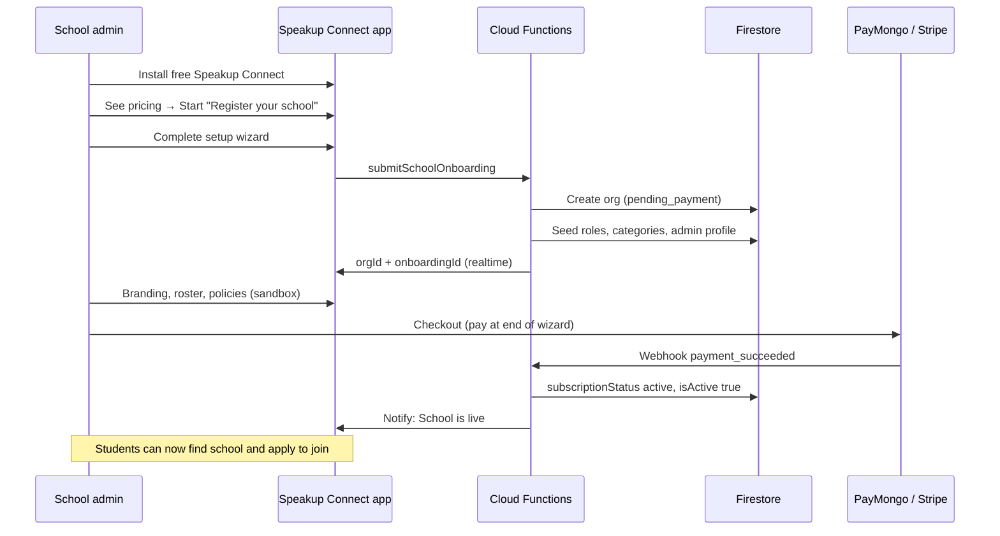
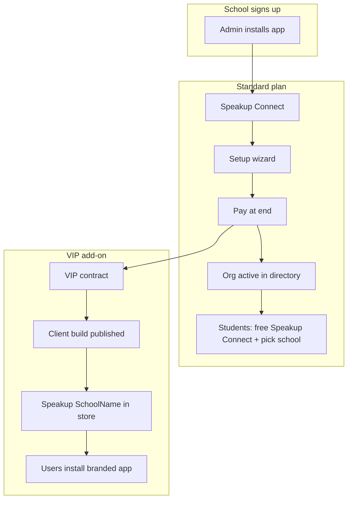

# School Onboarding, Subscriptions & VIP App Store Presence

> **Status:** Design approved — implementation planned (Epic 2.1, Epic 3.1)  
> **Audience:** Platform operators, product, and developers  
> **Related:** [ONBOARDING_NEW_SCHOOL.md](ONBOARDING_NEW_SCHOOL.md), [CLIENT_BUILDS.md](CLIENT_BUILDS.md), [DATABASE_DESIGN.md](DATABASE_DESIGN.md), [MASTER_TASK_LIST.md](MASTER_TASK_LIST.md)

This document defines how a **new school** joins SpeakUp Connect without requiring manual super-admin setup for every tenant, and how **VIP schools** get a **separate App Store / Play Store listing** with school-branded icon and launcher name (the MONHS model).

---

## 1. Two onboarding models

Schools choose (or are sold) one of two presence models. Both use the **same Firebase project and Firestore database**; they differ in how users install the app and what is fixed at compile time.

| | **Standard (multi-tenant)** | **VIP (client build)** |
|---|---|---|
| **Who it's for** | Most schools on the standard plan | Pilot schools, enterprise / VIP contracts |
| **Store listing** | One shared listing: **Speakup Connect** | **Separate listing per school** (e.g. **Speakup MONHS**) |
| **Launcher name under icon** | `Speakup Connect` | `Speakup {ShortName}` (e.g. `Speakup MONHS`) |
| **Launcher icon** | Default SpeakUp blue/green | School colors on the SpeakUp logo (GIMP + `flutter_launcher_icons`) |
| **Default org in app** | User picks school from global directory | Pre-loaded `orgId` at compile time (`FlavorConfig`) |
| **Student install** | Free **Speakup Connect** | Same VIP app **or** free standard app (school's choice at contract time) |
| **Admin setup** | Self-serve wizard in app → pay to activate | Wizard **plus** developer-published client build |
| **Rebuild to change icon/name** | No (runtime branding only) | Yes — new APK/IPA per icon/name change |
| **Deep dive** | This document §2–§5 | [CLIENT_BUILDS.md](CLIENT_BUILDS.md), [ONBOARDING_NEW_SCHOOL.md](ONBOARDING_NEW_SCHOOL.md) |

**MONHS today** is a **VIP client build** on the pilot branch: `lib/main.dart` → `FlavorConfig.monhs()`, launcher **Speakup MONHS**, org `monhs-ph-001`. See [ONBOARDING_NEW_SCHOOL.md §7](ONBOARDING_NEW_SCHOOL.md#7-reference--monhs-first-client-build).

---

## 2. Standard plan — self-serve wizard, pay at the end

### 2.1 Principles

1. **No manual Phase A** for every school — a Cloud Function provisions the org automatically.
2. **Pricing is visible before the wizard starts** — the admin knows this is a paid subscription.
3. **Configure first, pay to go live** — the admin completes setup (branding, roster, policies) in a **sandbox**; students cannot join until payment succeeds.
4. **Students always use the free standard app** — one global **Speakup Connect** listing; they pick their school from the directory (Epic 2.3).
5. **B2B billing on the web** — PayMongo or Stripe checkout + webhook; avoid App Store / Play IAP for institutional subscriptions (see §5).

### 2.2 Actor flow

### 2.3 Setup wizard (in-app)

Shown to authenticated users who are **not** yet linked to an active org admin role.

| Step | Collects | Notes |
|------|----------|--------|
| 1. Pricing & terms | Acknowledgement of subscription price, billing period, refund policy | Shown **before** step 2 |
| 2. School identity | Legal / display name, short name, type (`school`), region, city, contact email | Short name used in UI (e.g. `MONHS`) |
| 3. Branding | Primary + secondary hex (approved palette), optional logo upload | Writes to org doc; live preview in app |
| 4. Join policy | Require approval vs auto-approve roster matches | Maps to `signupRequiresApproval` + future `autoApproveRosterMatches` |
| 5. Admin account | Confirms registrant as org admin | Links Firebase UID to `organizations/{orgId}/users/{uid}` |
| 6. **Activate** | Summary + **Pay now** CTA | Opens web checkout; does not complete until webhook |

**Optional before payment:** import roster (CSV), configure report categories, preview splash/home with school colors.

**Blocked until payment:**

- Org appears in **global school directory** (`FindSchoolScreen`, Epic 2.3)
- Students can **apply to join** or be auto-approved
- Org-wide **alerts / announcements** to members
- Removing **“Activate your subscription”** banner in admin UI

### 2.4 Subscription and org lifecycle states

Proposed fields on `organizations/{orgId}` (extend [DATABASE_DESIGN.md](DATABASE_DESIGN.md)):

| Field | Type | Purpose |
|-------|------|---------|
| `subscriptionStatus` | `draft` \| `pending_payment` \| `active` \| `past_due` \| `suspended` \| `cancelled` | Gates platform access |
| `subscriptionTier` | `standard` \| `enterprise` \| `pilot` | Existing field — plan level |
| `subscriptionExpiresAt` | Timestamp \| null | Renewal / grace |
| `isActive` | boolean | **Public directory** and student join — `true` only when `subscriptionStatus === 'active'` |
| `onboardingCompletedAt` | Timestamp \| null | Wizard finished (may still be unpaid) |
| `activatedAt` | Timestamp \| null | First successful payment |

Supporting collection: `onboardingRequests/{requestId}`

| Field | Purpose |
|-------|---------|
| `requestedBy` | Admin Firebase UID |
| `orgId` | Generated org id |
| `status` | `in_progress` \| `awaiting_payment` \| `completed` \| `failed` |
| `wizardStep` | Resume wizard |
| `createdAt` / `updatedAt` | Audit |

The **initiating app** subscribes to `onboardingRequests/{requestId}` or `organizations/{orgId}` and updates UI when `subscriptionStatus` becomes `active`.

### 2.5 Automated Phase A (`submitSchoolOnboarding` callable)

**Trigger:** Admin submits wizard (before or at payment step, depending on step 6 design — org is created at first submit, payment activates).

**Server actions:**

1. Validate input; rate-limit per UID; reject duplicate pending orgs per admin.
2. Generate `orgId` (e.g. `{slug}-ph-001`).
3. Create `organizations/{orgId}` with `subscriptionStatus: pending_payment`, `isActive: false`, wizard branding fields.
4. Seed default **roles** and **report categories** (reuse `seed_roles.js` patterns).
5. Create `organizations/{orgId}/users/{adminUid}` with `role: admin`, `approvalStatus: approved`.
6. Create `onboardingRequests/{requestId}` linked to admin.
7. Optionally notify platform operator (email/Slack) for fraud review — **non-blocking**.
8. Return `{ orgId, onboardingRequestId }`.

**Not automated** (standard plan): separate App Store listing, custom `applicationId`, launcher icon recolor.

### 2.6 Payment activation

1. Admin taps **Activate subscription** → opens PayMongo/Stripe Checkout (hosted web).
2. Metadata: `orgId`, `onboardingRequestId`, `adminUid`.
3. Webhook `payment_succeeded` (or subscription created):
   - Set `subscriptionStatus: active`, `isActive: true`, `activatedAt`, `subscriptionExpiresAt`.
   - Update `onboardingRequests/{id}.status: completed`.
   - Send **in-app alert** (+ FCM when configured) to admin: *“{School name} is live. Students can now find your school in Speakup Connect.”*
4. Failed / abandoned checkout: org remains `pending_payment`; admin can retry from app.

**Super-admin override:** Platform console can set `subscriptionStatus: active` for pilot / PO / invoice schools without webhook.

### 2.7 Student flow (after activation)

1. Install **Speakup Connect** (standard listing, `lib/main_standard.dart`).
2. **Find school** in global directory (active orgs only).
3. Register → **Apply to join** with school-issued student ID.
4. Auto-approve or admin approval per school policy (Epic 2.3).
5. Use the app.

See [MASTER_TASK_LIST.md → Epic 2.3](MASTER_TASK_LIST.md) for directory and join-policy tasks.

### 2.8 Abuse controls

- Official school email encouraged; verify email before wizard.
- One `pending_payment` org per admin UID.
- Directory query: `isActive == true && subscriptionStatus == 'active'`.
- Firestore rules: unauthenticated users may read **limited** public org fields (name, region, logo) for directory only — not full org config.
- Optional manual review queue for first N production schools.

---

## 3. VIP plan — App Store presence (MONHS model)

### 3.1 What VIP buys

VIP / enterprise contracts add a **branded store presence** in addition to (or instead of) the standard multi-tenant experience:

| What users see | Standard app | VIP client build |
|----------------|--------------|------------------|
| Icon on home screen | SpeakUp default colors | **School colors** on SpeakUp logo |
| Name under icon | `Speakup Connect` | **`Speakup {ShortName}`** (e.g. `Speakup MONHS`) |
| Play / App Store | Shared listing | **Dedicated listing** per school |
| Package / bundle ID | `…speakup_connect` | `…speakup_connect.{orgId}` |

**Important:** Launcher icon and OS-visible app name are **baked into the binary**. They cannot be changed via Firestore alone; a new build and store submission is required. In-app colors, logo, and copy **can** still be updated live from Firestore / Admin Branding.

### 3.2 Who installs which app (VIP contract options)

| Audience | Typical install | Notes |
|----------|-----------------|--------|
| **All users (students + staff)** | VIP app **Speakup MONHS** | Strongest brand; org pre-loaded; no school picker |
| **Students** | Free **Speakup Connect** | Pick school from directory |
| **Admin / staff only** | VIP app or standard app | Contract-dependent |

MONHS pilot: **everyone** uses the VIP app with org `monhs-ph-001` pre-loaded.

### 3.3 VIP + subscription relationship

VIP is an **add-on** on top of an active org subscription:

1. School completes **standard self-serve wizard** (or legacy manual onboarding) → org exists and is **paid / active**.
2. School purchases **VIP / enterprise** tier (higher `subscriptionTier`, separate contract line item).
3. **SpeakUp platform team** runs the [client build checklist](ONBOARDING_NEW_SCHOOL.md#5-checklist--onboarding-a-new-school-client-build):
   - GIMP icon → `assets/icons/flavors/{orgId}/icon.png`
   - `FlavorConfig.{orgId}()` with `appDisplayName: 'Speakup {ShortName}'`, `orgId`, and **baked `ClientOrgDefaults`** (colors, type, display name) for offline first launch
   - Android `productFlavors`, iOS scheme, Firebase app registration
   - Publish to **separate** Play Console / App Store Connect listing
4. School communicates install link: *“Download **Speakup {ShortName}** from the store”* instead of generic Speakup Connect.

**Billing:** VIP setup fee + recurring enterprise tier; client build and store maintenance are **not** self-serve in v1 (developer / CI publishes the binary).

### 3.4 VIP technical reference (MONHS)

| Item | MONHS value |
|------|-------------|
| Flavor | `monhs` |
| Firestore `orgId` | `monhs-ph-001` |
| Launcher name | `Speakup MONHS` |
| Entry point | `lib/main.dart` |
| Baked defaults | `ClientOrgDefaults` in `lib/flavor_config.dart` (`#CE1126` / `#111111`, type `school`) |
| Target `applicationId` | `com.speakupconnect.speakup_connect.monhs` |
| Build (when flavors wired) | `flutter build appbundle --flavor monhs -t lib/main.dart --release` |

Full Gradle, iOS, CI, and icon workflow: [CLIENT_BUILDS.md](CLIENT_BUILDS.md).

### 3.5 What VIP schools still configure in the wizard / admin panel

Even with a client build, admins should complete the same **org setup** (roster, join policy, categories). Firestore remains source of truth for in-app behavior. The client build only fixes **OS-level** identity (icon, launcher name, default org id, offline color fallback).

---

## 4. Comparison at a glance

---

## 5. Billing implementation notes

| Topic | Recommendation |
|-------|----------------|
| **Where to pay** | Hosted checkout on web (PayMongo for PH, Stripe optional) |
| **Why not IAP** | School subscriptions are B2B; avoid 15–30% store fees and institutional purchase friction |
| **App UX** | Deep link or in-app browser to checkout; return URL opens app with activation polling |
| **Invoices / DepEd PO** | Super-admin marks org `active` manually; store `billingSource: manual` |
| **Renewals** | Webhook `invoice.paid` extends `subscriptionExpiresAt`; `past_due` grace then `suspended` |

---

## 6. Implementation backlog (cross-reference)

| Epic | Tasks |
|------|--------|
| **2.1 Organization Onboarding** | In-app wizard, `submitSchoolOnboarding`, `onboardingRequests`, activation UI, admin notification |
| **2.3 Organization Finder** | `FindSchoolScreen`, active-org query, runtime `orgId` on student profile |
| **3.1 SaaS Infrastructure** | PayMongo/Stripe, webhooks, `subscriptionStatus` enforcement, platform admin dashboard |
| **Client builds (VIP)** | Already documented; execute per [ONBOARDING_NEW_SCHOOL.md](ONBOARDING_NEW_SCHOOL.md) when contract signed |

Update [MASTER_TASK_LIST.md](MASTER_TASK_LIST.md) Epic 2.1 and 3.1 as implementation proceeds.

---

## 7. Related documents

| Document | Contents |
|----------|----------|
| [ONBOARDING_NEW_SCHOOL.md](ONBOARDING_NEW_SCHOOL.md) | VIP client build checklist, GIMP icon, Gradle flavors |
| [CLIENT_BUILDS.md](CLIENT_BUILDS.md) | Technical flavor setup, CI/CD, store listings |
| [DATABASE_DESIGN.md](DATABASE_DESIGN.md) | `organizations/{orgId}` schema |
| [SPEAKUP CONNECT BRANDING.md](SPEAKUP%20CONNECT%20BRANDING.md) | Brand rules, approved palettes |
| [PROJECT_OVERVIEW.md](PROJECT_OVERVIEW.md) | Multi-tenant SaaS vision |
