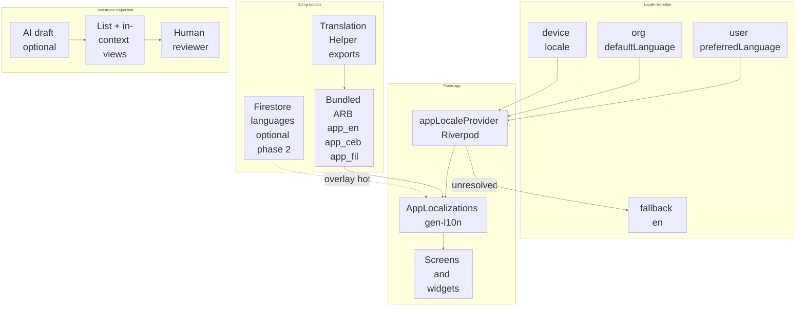
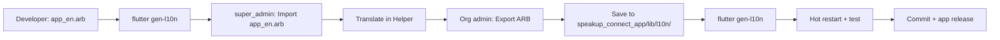
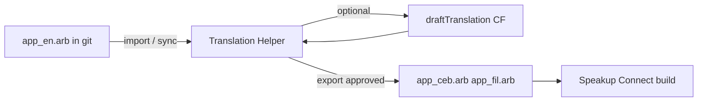
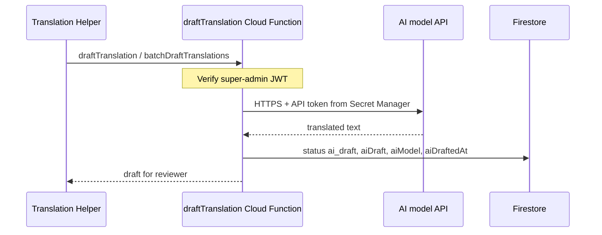

# Internationalization (i18n) — Architecture

> **Status:** Phase 1 + 1b shipped (June 2026) — `app_en.arb` / `app_ceb.arb` (English placeholders), Home + Settings language pickers, locale-aware help, `kLanguageNativeLabels`  
> **End-to-end workflow (canonical):** [§11](#11-end-to-end-workflow-canonical) — setup → translate → export → app release (all steps in one place)  
> **Tasks:** [MASTER_TASK_LIST.md → Epic 2.5](MASTER_TASK_LIST.md) (authoritative checklist) · [SPRINT_TRACKER.md](SPRINT_TRACKER.md) (Sprint 15 delivered, Sprint 16 planned) · **GitHub:** [#48–#53](https://github.com/edbecnel/speakup-connect/issues?q=is%3Aissue+is%3Aopen+label%3Aepic%3A2.5)  
> **Priority:** High — see language rollout table below  
> **Epic:** [MASTER_TASK_LIST.md → Epic 2.5](MASTER_TASK_LIST.md)  
> **Related:** [DATABASE_DESIGN.md](DATABASE_DESIGN.md), [ARCHITECTURE.md](ARCHITECTURE.md), [RBAC_ARCHITECTURE.md](RBAC_ARCHITECTURE.md)

SpeakUp Connect serves Philippine schools where students and parents use **US English**, **Tagalog**, **Bisaya (Cebuano)**, and other regional languages. This document defines how UI translation works before implementation begins.

---

## 1. Goals and non-goals

### Goals

1. **US English (`en`, `en_US`)** is the **home language** — canonical source for every string key, developer authoring, and fallback when a translation is missing.
2. **Tagalog (`fil`)** is the **second platform language** (nationwide).
3. **Bisaya / Cebuano (`ceb`)** is the **first regional translation** — prioritized for MONHS and Visayas/Mindanao pilots (may ship before Tagalog is 100% complete).
4. User can switch language on **Home** (prominent globe dropdown) and in **Settings → Appearance → Language**.
5. Choice persists **locally** (fast cold start) and syncs to **`users/{uid}.preferredLanguage`**.
6. Org admins can set **`defaultLanguage`** and **`supportedLanguages`** on the org document.
7. App works **offline** with bundled translations (no network required to render UI).
8. A **Translation Helper** tool (web or admin app) lets human interpreters work in context or in a list, with **optional AI-generated first drafts**.
9. Additional languages (Hiligaynon, Ilocano, etc.) use the same ARB + Translation Helper pipeline.

### Language rollout order

| Order | Code | Language | Scope |
|-------|------|----------|--------|
| **Home** | `en` | **US English** | Source of truth; `app_en.arb`; `Locale('en', 'US')` |
| **1st add-on** | `ceb` | **Bisaya / Cebuano** | MONHS / Visayas–Mindanao pilots |
| **2nd** | `fil` | **Tagalog** | Platform-wide second language |
| **3rd+** | … | Hiligaynon, Ilocano, etc. | Via Translation Helper as schools expand |

MONHS may enable `ceb` in the app before Tagalog strings are fully reviewed; both ARB files ship in the same codebase when ready.

### Non-goals (v1)

- Translating **user-generated content** (announcements, reminders, report descriptions) — authors write in their own language.
- **Runtime** machine translation in the member app (users always see pre-reviewed bundled strings).
- Per-org custom UI string overrides (consider later via Firestore overlay).
- RTL layouts (not required for planned languages).

---

## 2. Language codes

| Code | UI label | Rollout | Notes |
|------|----------|---------|--------|
| `en` | English (US) | Home | Canonical; `app_en.arb`; fallback |
| `ceb` | Bisaya / Cebuano | 1st add-on | ISO 639-2 `ceb`; MONHS pilot |
| `fil` | Tagalog | **2nd language** | ISO 639-1 `fil` (Filipino); nationwide |

Use **BCP 47** in Flutter: `en_US`, `ceb`, `fil`.

**Language picker labels** use **`kLanguageNativeLabels`** in `lib/core/l10n/locale_provider.dart` — **not** ARB strings. Each option is always shown in its own language (**“English”**, **“Bisaya / Cebuano”**, **“Tagalog”** when added) so users can find their language before the rest of the UI is translated. See [§6.1](#61-language-picker-and-klanguagenativelabels).

Org field `supportedLanguages` lists enabled codes, e.g. `["en", "ceb", "fil"]`. The selector will eventually filter by org; today it lists all codes in `supportedAppLanguageCodes`.

---

## 3. Architecture overview



**Recommended stack:** Flutter **`gen-l10n`** (`flutter_localizations` + ARB files) for all static UI strings, plus **`intl`** for dates/numbers. Optional **Firestore overlay** in a later phase for super-admin hotfixes without app release.

---

## 4. Resolution order

When the app starts or the user changes language:

1. **Cached local preference** (`SharedPreferences`: `preferred_language_code`) — immediate, no auth required for display after first set.
2. **Signed-in user profile** `preferredLanguage` — syncs across devices; wins over cache when loaded.
3. **Organization** `defaultLanguage` — when user has no preference (first launch).
4. **Device locale** — only if it matches an org-supported, active language.
5. **Fallback:** `en`.

```dart
// Pseudocode — lib/core/l10n/locale_resolution.dart
Locale resolveLocale({
  required String? userPreferred,
  required String? cachedPreferred,
  required String orgDefault,
  required List<String> orgSupported,
  required Locale deviceLocale,
}) {
  for (final code in [userPreferred, cachedPreferred, orgDefault]) {
    if (code != null && orgSupported.contains(code)) {
      return Locale(code);
    }
  }
  if (orgSupported.contains(deviceLocale.languageCode)) {
    return Locale(deviceLocale.languageCode);
  }
  return const Locale('en');
}
```

---

## 5. Flutter project structure

```
lib/
├── l10n/
│   ├── app_en.arb              # US English source (template) — home language
│   ├── app_ceb.arb             # Bisaya / Cebuano (1st add-on; may duplicate en until translated)
│   ├── app_fil.arb             # Tagalog (2nd language) — not started
│   ├── app_localizations.dart  # generated by gen-l10n
│   └── untranslated.json       # gen-l10n report (CI, when enabled)
├── core/
│   └── l10n/
│       ├── locale_provider.dart            # appLocaleProvider, kLanguageNativeLabels
│       └── app_localizations_extension.dart  # context.l10n
├── shared/widgets/
│   └── language_selector.dart  # LanguageSelectorDropdown, showLanguagePickerSheet
├── features/help/
│   └── data/help_asset_resolver.dart       # locale-aware markdown paths
```

**`l10n.yaml`** (project root):

```yaml
arb-dir: lib/l10n
template-arb-file: app_en.arb
output-localization-file: app_localizations.dart
nullable-getter: false
```

**`pubspec.yaml`:**

```yaml
dependencies:
  flutter:
    sdk: flutter
  flutter_localizations:
    sdk: flutter
  intl: any

flutter:
  generate: true
```

**`MaterialApp` wiring** (`lib/app.dart`):

```dart
localizationsDelegates: AppLocalizations.localizationsDelegates,
supportedLocales: AppLocalizations.supportedLocales,
locale: ref.watch(appLocaleProvider),
```

---

## 6. String key conventions

Dot-separated, feature-first (matches existing `DATABASE_DESIGN` examples):

| Pattern | Example |
|---------|---------|
| `{feature}.{screen}.{element}` | `auth.login.title` |
| `{feature}.{action}` | `reports.submit.button` |
| `common.{element}` | `common.cancel`, `common.save` |

**Rules:**

- Keys are **English snake/camel in ARB metadata only**; user-visible text lives in `value`.
- No string concatenation for sentences — use **placeholders** for variables and plurals.
- Prefer full sentences in one key so word order can differ in Tagalog or Cebuano.

**ARB example (`app_en.arb`):**

```json
{
  "@@locale": "en",
  "authLoginTitle": "Sign In",
  "homeWelcome": "Welcome, {name}",
  "@homeWelcome": {
    "placeholders": {
      "name": { "type": "String" }
    }
  },
  "reportsCount": "{count, plural, =0{No reports} =1{1 report} other{{count} reports}}",
  "@reportsCount": {
    "placeholders": {
      "count": { "type": "int" }
    }
  }
}
```

Generated usage:

```dart
Text(context.l10n.authLoginTitle)
Text(context.l10n.homeWelcome(firstName))
```

Add a thin extension on `BuildContext` for ergonomics: `context.l10n`.

---

## 6.1 Language picker and `kLanguageNativeLabels`

Language **option labels** in pickers must **not** come from `AppLocalizations` (ARB). If the UI is English, localized picker labels would still be English and non-English speakers could not find **Bisaya / Cebuano**.

**Requirement:** maintain a single map beside `supportedAppLanguageCodes`:

```dart
// lib/core/l10n/locale_provider.dart
const supportedAppLanguageCodes = ['en', 'ceb'];

const kLanguageNativeLabels = <String, String>{
  'en': 'English',
  'ceb': 'Bisaya / Cebuano',
};
```

**Rules when adding a language:**

1. Add the code to `supportedAppLanguageCodes` (order = display order in pickers).
2. Add a **native** display name to `kLanguageNativeLabels` (how speakers of that language refer to it).
3. Add `app_{code}.arb` (may copy English from `app_en.arb` until Translation Helper export).
4. Add help markdown `*_guide_{code}.md` under `assets/help/` (may copy English until translated).
5. Do **not** use ARB keys for picker option text — ARB is for chrome *after* locale is chosen (`settingsLanguage` for section titles / semantics is fine).

**UI entry points (implemented):**

| Location | Widget | Notes |
|----------|--------|--------|
| **Home** (top of scroll) | `LanguageSelectorDropdown` | Globe icon + dropdown; primary discoverability |
| **Settings → Appearance → Language** | `showLanguagePickerSheet` | Radio list; same native labels |

Implementation: `lib/shared/widgets/language_selector.dart`.

**Persistence:** `appLocaleProvider` writes `preferred_language_code` to `SharedPreferences`. Firestore `users/{uid}.preferredLanguage` sync is planned (§8).

**Help:** `helpLanguageCodeForLocale` maps the active `Locale` to a markdown suffix (`ceb` → `member_guide_ceb.md`). See §7.

---

## 7. What gets translated

| Content type | Mechanism | v1 |
|--------------|-----------|-----|
| Buttons, labels, errors, nav titles | ARB / `AppLocalizations` | ✅ phase 1 (auth, splash, home, settings, help hub); ✅ **groups** screens (`groups*` keys in `app_en.arb`, June 2026) |
| Language picker **option** labels | `kLanguageNativeLabels` only — **not** ARB | ✅ |
| Validation messages in `validators.dart` | Move to l10n keys | ⏳ |
| `SnackBar` / dialog copy in features | Replace hardcoded strings | ⏳ phase 2 — reports, admin, announcements, reminders, roles, notifications (groups shipped June 2026) |
| `intl` dates and numbers | Pass active locale from `appLocaleProvider` | ⏳ |
| Help markdown (`assets/help/`) | Per-locale: `member_guide_ceb.md`, `member_guide_fil.md` | ✅ resolver; content mostly English placeholders |
| Firestore org `welcomeMessage`, `tagline` | Admin-authored; not auto-translated | — |
| Announcements, reminders, alerts body | User-authored | — |
| Push notification titles from Cloud Functions | Duplicate keys in functions i18n map or template per locale | phase 2 |

### Help content strategy

Mirror UI locales under assets:

```
assets/help/
  school/
    member_guide.md
  _default/
    member_guide.md
    member_guide_ceb.md
    member_guide_fil.md
  school/
    member_guide.md
    member_guide_ceb.md
    member_guide_fil.md
```

`HelpAssetResolver` loads help assets with this fallback order:
`{orgType} -> _default` and per-locale file before English base
(see `lib/features/help/data/help_asset_resolver.dart`).

---

## 8. Data layer

### User profile (existing)

`organizations/{orgId}/users/{uid}.preferredLanguage` — see [DATABASE_DESIGN.md](DATABASE_DESIGN.md).

On change in Settings:

1. Update `localeProvider` state (immediate UI rebuild).
2. Write `SharedPreferences`.
3. `updateDoc` on user profile (if signed in).

### Organization (existing)

```json
{
  "defaultLanguage": "ceb",
  "supportedLanguages": ["en", "ceb"]
}
```

MONHS pilot suggestion: `defaultLanguage: "ceb"`, `supportedLanguages: ["en", "ceb", "fil"]` so Bisaya is default with English and Tagalog one tap away.

### Firestore `languages/` collection (phase 2 — optional OTA)

Already sketched in [DATABASE_DESIGN.md](DATABASE_DESIGN.md) and `firestore.rules` (read: signed-in; write: super-admin).

**Phase 1:** Ship ARB only — no runtime dependency on Firestore for UI.

**Phase 2:** `LanguageRepository` merges Firestore overrides on top of bundled ARB for super-admin hotfixes. Keys must match ARB message IDs.

---

## 9. Riverpod providers

| Provider | Status | Responsibility |
|----------|--------|----------------|
| `appLocaleProvider` | ✅ | Current `Locale`; `setLanguageCode`; `SharedPreferences` cache |
| `supportedLocalesForOrgProvider` | ⏳ | Filter pickers by org `supportedLanguages` |
| Full locale resolution | ⏳ | User profile + org default + device locale (§4) |

`MaterialApp` watches `appLocaleProvider`. Planned: re-resolve when `organizationConfigProvider` and `userProfileProvider` load.

---

## 10. Migration strategy (no big-bang)

1. ✅ **Infrastructure** — `l10n.yaml`, `app_en.arb`, `appLocaleProvider`, wire `MaterialApp`.
2. ✅ **English extraction (phase 1)** — **auth**, **splash**, **settings**, **home**, **help hub** → `app_en.arb`.
3. ✅ **Phase 1b hookup** — `app_ceb.arb` (English placeholders), locale-aware `HelpAssetResolver`, `*_ceb.md` help assets.
4. ✅ **Language pickers** — Home `LanguageSelectorDropdown` + Settings; `kLanguageNativeLabels`.
5. **Translation Helper** (MVP) — import `app_en.arb`; export `app_ceb.arb` / `app_fil.arb`.
6. **Cebuano pass** — AI draft + human review → real `app_ceb.arb` + `member_guide_ceb.md` content.
7. **Tagalog pass** — same workflow → `app_fil.arb` (second language).
8. **Feature-by-feature extraction** — remaining hardcoded UI → `app_en.arb`:
   - Auth: register, apply-to-join
   - Reports: submit, my reports, details, confirmation
   - Admin: roster, approvals, branding, grades, members, enrolled users
   - Groups: browse, create, membership requests, policy sheets
   - Announcements + reminders (compose, detail, responses, widgets)
   - Roles, notifications/alerts, settings sub-screens
9. **CI** — fail build if `app_ceb.arb` or `app_fil.arb` missing keys from `app_en.arb`; lint ban on new hardcoded strings in `presentation/`
10. **Firestore** — `preferredLanguage` sync + org `supportedLanguages` filter on pickers + admin branding UI

**Lint:** add custom lint or CI script banning new raw strings in `presentation/` (except debug).

---

## 11. End-to-end workflow (canonical)

**This section is the single source of truth** for updating bundled locale files (`app_ceb.arb`, `app_fil.arb`, …). Architecture detail lives in §13; Translation Helper setup commands in [tools/translation-helper/README.md](../../speakup_connect_web/tools/translation-helper/README.md).

### Overview



| Phase | Who | Where | Output |
|-------|-----|-------|--------|
| A — Platform setup (once) | Deployment lead | PowerShell + Firebase | Functions + web tool ready |
| B — New English strings | Developer | `speakup_connect_app/lib/l10n/app_en.arb` | New keys in repo |
| C — Sync English to Firestore | Platform `super_admin` | Translation Helper | `languages/{locale}/strings/*` rows |
| D — Translate & review | Org admin / moderators | Translation Helper or in-app **Translations** | `approved` rows in Firestore |
| E — Export to repo | Org admin | Translation Helper **Export ARB** | Downloaded `app_ceb.arb` |
| F — Bundle in app | Developer | `speakup_connect_app/lib/l10n/` + `flutter gen-l10n` | Generated `app_localizations_*.dart` |
| G — Verify & ship | Developer / QA | Device or emulator | Commit + release build |

Workflow data lives in Firestore (`languages/{locale}/strings/{stringKey}`) until export; **users only see strings after a new app build** with updated ARB files.

---

### Phase A — One-time platform setup

Complete once per Firebase project (or after adding translation callables). Detailed commands: [Translation Helper README](../../speakup_connect_web/tools/translation-helper/README.md).

1. **Deploy translation Cloud Functions** from repo root:

   ```powershell
   cd D:\Dev\Speakup-Connect\shared\functions
   npm run build
   cd ..
   Remove-Item Env:GOOGLE_APPLICATION_CREDENTIALS -ErrorAction SilentlyContinue
   $env:FUNCTIONS_DISCOVERY_TIMEOUT = "60"
   npx firebase-tools deploy --only functions:getTranslationWorkspaceAccess,functions:importTranslationSource,functions:listTranslationEntries,functions:saveTranslationEntry,functions:draftTranslation,functions:batchDraftTranslations,functions:batchSaveAiDrafts,functions:batchApproveSavedTranslations,functions:exportTranslationArb,functions:listTranslationScreens,functions:createTranslationScreen,functions:updateTranslationScreen,functions:deleteTranslationScreen
   ```

2. **Optional — AI draft:** copy `shared/functions/.env.example` → `shared/functions/.env`, set `TRANSLATION_AI_API_KEY`, redeploy `draftTranslation` and `batchDraftTranslations`.

3. **Seed roles** (`manageTranslations` capability): `node shared/scripts/seed_roles.js`

4. **Grant access:**
   - Org admins — full locale edit, batch AI, export (via org admin role).
   - Translation moderators — edit / approve per role assignment in app.
   - Platform `super_admin` — **Import `app_en.arb` only** (`node shared/scripts/assign_super_admin.js`).

5. **Web Translation Helper:** copy `speakup_connect_web/tools/translation-helper/firebase-config.example.js` → `firebase-config.js`, set Firebase web config + `ORGANIZATION_ID`, run `.\start.ps1` from `speakup_connect_web/tools/translation-helper/` (prints **`http://<YOUR-LAN-IP>:5050`** for phones/tablets/other PCs on Wi‑Fi; `localhost:5050` on the server PC only). Set `USE_FUNCTIONS_EMULATOR = false` for LAN access (required unless you use localhost + Functions emulator only).

---

### Phase B — Developer adds English strings

**Rule:** All new user-facing UI text goes in **`speakup_connect_app/lib/l10n/app_en.arb` only** — never hardcoded in widgets. See [CODING_STANDARDS.md → String Localization](CODING_STANDARDS.md).

1. Add the key and US English copy to `speakup_connect_app/lib/l10n/app_en.arb` (include `@key` metadata for placeholders).
2. Reference it in Dart via `context.l10n.yourKey` (or existing extension).
3. Regenerate localizations:

   ```powershell
   cd D:\Dev\Speakup-Connect\speakup_connect_app
   flutter gen-l10n
   ```

4. Commit `app_en.arb` and generated `app_localizations*.dart` with your feature work.

New keys are **not** in Cebuano/Tagalog until Phase C–G.

**If you maintain a reviewer CSV in the repo** (e.g. `speakup_connect_app/lib/l10n/ceb_translations.csv`), refresh the **`screen`** column after every `app_en.arb` change — see [Populate screen column](#populate-screen-column-for-reviewer-csv) below.

---

### Phase C — Import English source into Translation Helper

**Who:** platform `super_admin` only (once per batch of new keys, or after each `app_en.arb` update).

1. Open Translation Helper → sign in as `super_admin`.
2. Select **Target locale** (`ceb` or `fil`).
3. Click **Import `app_en.arb`** → choose `speakup_connect_app/lib/l10n/app_en.arb`.
4. Wait for success (reports new/updated key counts) → **Refresh**.

Org admins and moderators **cannot** import; they edit rows created by this step. If a key is missing in the tool after you added it to `app_en.arb`, re-run import — the tool reads Firestore, not your local ARB.

---

### Phase D — Translate and review

**Where:** Translation Helper web UI (`speakup_connect_web/tools/translation-helper/`), **Settings → Administration → Translations** (list workspace), or **Browse app in translation mode** (in-context badges on admin-configured app screens).

**Status flow:** `missing` → `ai_draft` → `in_review` (saved/in-review) → `approved`

| Step | Action | Who | Result |
|------|--------|-----|--------|
| 1 | **Translate missing (AI)** | Org admin | Batch AI drafts for all `missing` / `ai_draft_failed` rows (chunked; may take several minutes) |
| 2 | **Save all AI drafts** | Org admin / moderator | Copies `ai_draft` → saved target as `in_review` |
| 3 | Edit **Target** column if needed → **Save** | Anyone with access | `in_review` |
| 4 | **Approve** (per row) or **Approve all saved/in-review** | Anyone with access | `approved` — ready for export |

#### In-app translation mode (in-context, MVP)

**Who:** org admin **or** `manageTranslations`.

Use when reviewers need English meaning **on the real screen** before writing Cebuano/Tagalog.

| Step | Action |
|------|--------|
| 0 | **Screen names** — create names, assign to app routes, enable **Translation badges** (see below) |
| 1 | **Settings → Translations** → target locale → **Browse app in translation mode** |
| 2 | Banner toggle **English** ↔ target locale (preview) |
| 3 | On badge-enabled screens, tap **globe badge** on a labeled string → edit → **Save** (session queue) |
| 4 | Banner **Review** → **Save N edits to Firestore** (`languages/{locale}/strings/{key}`) |
| 5 | Optional: continue in web Translation Helper → **Refresh** → approve → **Export ARB** (Phase E) |

**Badge coverage:** Org admins and translation moderators choose which app screens show edit badges via **Screen names** (app: **Translations → list icon**; web: **Screen names** tab). Only screens with **Translation badges** enabled display globe badges during translation mode. Developers must still wrap strings with `TranslationAnchor` in code — configuration controls visibility, not instrumentation. Screens without badges still respect the English/target preview toggle; use the list workspace or web tool to edit those strings.

**Placeholder rules:** Keep `{name}`, `{count}`, and ICU plural blocks (`{count, plural, =1{…} other{…}}`) structurally identical to English; only translate human-readable words inside branches.

**AI tips:** Single-row **AI draft** for retries. If batch AI times out, redeploy functions and use `$env:FUNCTIONS_DISCOVERY_TIMEOUT = "60"` when deploying.

#### Screen names and translation badge configuration

**Who:** org admin **or** `manageTranslations`.

**Where:**

| Surface | Path |
|---------|------|
| Mobile app | **Settings → Administration → Translations** → app bar **list icon** → **Screen names** |
| Web Translation Helper | **Screen names** tab (after sign-in) |

**Firestore:** `organizations/{orgId}/translationScreens/{screenId}` — fields: `name`, `assignedRoute`, `badgeEnabled`.

| Task | How |
|------|-----|
| **Create** screen name | Add a name in the catalog (no route yet) |
| **Rename** | Edit name → **Save** — updates string `context` values that used the old name |
| **Delete** | Only when not assigned to a route |
| **Assign to app screen** | Pick a screen name per route (one name ↔ one route) |
| **Unassign** | Clears route and turns off badges for that name |
| **Enable translation badges** | Toggle **Translation badges** on an assigned route — controls in-app globe badges during translation mode |
| **Tag a string** | In translation workspace, set **Screen name** dropdown per row (`context` in Firestore) |

**Rules:**

- A screen name assigned to route A cannot be selected for route B until unassigned from A.
- **Translation badges** can only be enabled when a screen name is assigned to a route.
- Many translation strings may share the same screen name; badge gating is **per app route**, not per string.

**Deploy (functions):** include `listTranslationScreens`, `createTranslationScreen`, `updateTranslationScreen`, `deleteTranslationScreen` when deploying translation callables (see Phase A).

#### Human reviewer CSV workflow (Google Sheets)

Use this when a translator works offline in a spreadsheet (no app access). Screenshots per screen supplement the sheet.

| Step | Action | Who |
|------|--------|-----|
| 1 | **Export CSV** in Translation Helper (target locale `ceb` / `fil`), or refresh an existing repo CSV — see below | Org admin / moderator |
| 2 | **Populate `screen` column** (essential after English keys change) | Developer or org admin |
| 3 | Upload CSV to Google Sheets; share with translator | Org admin |
| 4 | Translator edits **`translation`**; optional **`notes`**, **`verified`**, **`status`** | Translator |
| 5 | Download sheet as CSV → **Import CSV** in Translation Helper | Org admin / moderator |
| 6 | Review in workspace → **Approve** (or import with `status=approved`) | Org admin / moderator |
| 7 | **Export ARB** → Phase F | Org admin |

**CSV columns:** `key`, `screen`, `english`, `translation`, `notes`, `verified`, `status`

| Column | Required on import | Persisted |
|--------|-------------------|-----------|
| `key`, `translation` | Yes | Firestore `targetValue` |
| `screen` | No | Firestore `context` |
| `status` | No (`in_review` default) | Firestore `status` |
| `english` | No | Export only (reference) |
| `notes`, `verified` | No | Browser session only — re-import CSV after **Refresh** |

Old four-column CSVs (`key`, `english`, `translation`, `status`) still import correctly.

#### Populate screen column for reviewer CSV

**When:** After **`app_en.arb`** is updated (new keys, renamed keys, or keys moved to a different screen in Dart). Run this **before** sharing the CSV with a human reviewer so the **`screen`** column shows where each string appears.

**What it does:** Scans `speakup_connect_app/lib/**/*.dart` for `context.l10n.*` / `l10n.*` usage, maps each key to a human-readable screen name (e.g. `Admin Dashboard`, `Login`, `Shared`), and writes the **`screen`** column into your CSV. Keys only referenced indirectly fall back to key-name heuristics.

From repo root:

```powershell
cd D:\Dev\Speakup-Connect
node speakup_connect_web/tools/translation-helper/populate-csv-screens.js speakup_connect_app/lib/l10n/ceb_translations.csv
```

For Tagalog, use your `fil` CSV path instead. The script creates a `screen` column if missing, or overwrites existing `screen` values.

**Typical loop after a feature adds English strings:**

1. Phase B — add keys to `app_en.arb`, `flutter gen-l10n`, commit.
2. Phase C — `super_admin` imports `app_en.arb` into Translation Helper.
3. **Export CSV** from Translation Helper (or copy the repo CSV template).
4. Run **`populate-csv-screens.js`** on that file.
5. Share the CSV (+ screenshots) with the reviewer.
6. After edits, **Import CSV** → translations and `screen` values sync to Firestore.

Scripts: `speakup_connect_web/tools/translation-helper/map-l10n-screens.js` (mapping logic), `speakup_connect_web/tools/translation-helper/populate-csv-screens.js` (CSV writer).

---

### Phase E — Export ARB

**Who:** org admin (or `super_admin`).

1. In Translation Helper, confirm target locale and that strings to ship are **`approved`** (export uses approved `targetValue`, with English fallback for unapproved keys if configured).
2. Click **Export ARB** → save the downloaded JSON as:
   - `speakup_connect_app/lib/l10n/app_ceb.arb` for Cebuano, or
   - `speakup_connect_app/lib/l10n/app_fil.arb` for Tagalog.
3. Overwrite the existing file in the repo (export strips `@` metadata — that is normal; metadata stays in `app_en.arb` only).

---

### Phase F — Bundle translations in the Flutter app

1. Place the exported file in `speakup_connect_app/lib/l10n/`.
2. Regenerate Dart localizations:

   ```powershell
   cd D:\Dev\Speakup-Connect\speakup_connect_app
   flutter gen-l10n
   ```

   This updates `app_localizations_ceb.dart` (and related generated files). Commit the ARB **and** generated Dart together.

3. **Run the app:**
   - **Hot restart (`R`)** in an active `flutter run` session — not hot reload (`r`).
   - **Settings → Language** → select **Bisaya / Cebuano** (or your target locale).
   - Confirm strings on Home, Settings, and affected screens.

4. **Note:** Firestore org fields like `welcomeMessage` are English-only in phase 1; the app uses ARB templates for non-English locales on the home welcome line.

---

### Phase G — Commit and release

1. Commit `speakup_connect_app/lib/l10n/app_{locale}.arb` and generated `app_localizations_*.dart`.
2. Ship via normal app release (Play Store / TestFlight / APK). **There is no over-the-air string update** in phase 1 — users need a build that includes the new ARB.

---

### Roles quick reference

| Action | Translation moderator | Org admin | Platform super_admin |
|--------|----------------------|-----------|----------------------|
| Edit / Save / Approve | Yes | Yes | Yes |
| Manage screen names & translation badges | Yes | Yes | Yes |
| Browse app in translation mode (in-context) | Yes | Yes | Yes |
| AI draft (single row) | Yes | Yes | Yes |
| Save all AI drafts | Yes | Yes | Yes |
| Translate missing (AI batch) | No | Yes | Yes |
| Approve all saved/in-review | Yes | Yes | Yes |
| Export ARB | No | Yes | Yes |
| Import `app_en.arb` | No | No | Yes |

---

### Troubleshooting (workflow)

| Symptom | Fix |
|---------|-----|
| New key not in Translation Helper | `super_admin` re-imports `app_en.arb`, then Refresh |
| `functions/internal` on batch AI (~60s) | Functions deploy timed out during discovery — set `$env:FUNCTIONS_DISCOVERY_TIMEOUT = "60"` and redeploy |
| `TRANSLATION_AI_API_KEY is not set` | Add key to `functions/.env`, redeploy AI callables |
| Placeholder mismatch on AI draft | Redeploy `draftTranslation` / `batchDraftTranslations`; retry row. ICU plurals must keep `{count, plural, …}` structure |
| Save all AI drafts fails ICU check | Redeploy `saveTranslationEntry` and `batchSaveAiDrafts` |
| Approve all skips a row | Row may be `in_review` with only `aiDraft` — use **Save all AI drafts** first, or **Approve** on the row |
| Cebuano reverts after hot restart | Ensure locale is Cebuano in Settings; pull latest app code (locale bootstrap fix). Hot **restart**, not reload |
| Deploy: `Timeout after 10000` | `$env:FUNCTIONS_DISCOVERY_TIMEOUT = "60"` before `firebase deploy` |

More setup detail: [tools/translation-helper/README.md](../../speakup_connect_web/tools/translation-helper/README.md). In-app help: **Help Center → Administrator Guide → UI translations**.

---

## 12. Translation workflow (developers) — superseded

> **Use [§11 End-to-end workflow](#11-end-to-end-workflow-canonical)** instead. This section is kept as a short reminder only.

1. Developer adds key to **`app_en.arb` only** (US English copy).
2. Run `flutter gen-l10n`.
3. `super_admin` imports `app_en.arb` into Translation Helper.
4. Translators fill target language → **approved**.
5. Org admin exports ARB → `speakup_connect_app/lib/l10n/app_{locale}.arb`.
6. `flutter gen-l10n` → hot restart → commit → app release.

**MONHS:** Cebuano review with teachers/students before pilot-wide rollout. Tagalog review with Luzon-based reviewers before nationwide enablement.

---

## 13. Translation Helper tool

A separate **Message Translator Helper** (web app or super-admin Flutter/web module) scales localization beyond Cebuano and Tagalog. It is the primary workspace for human interpreters and optional AI first drafts — **not** a runtime dependency for end users.

### Purpose

- Show every UI string from **`app_en.arb`** with **context** so translators understand where text appears.
- Support **many future languages** without bespoke tooling per locale.
- Produce **importable ARB** (or Firestore JSON) for the main app build.

### Users

| Role | Access |
|------|--------|
| Super-admin | All languages, import English source, export, configure AI |
| Org admin | Org `supportedLanguages`; edit, approve, export, batch AI |
| User with **`manageTranslations`** | Same locales as org admin; edit, single AI draft, approve |
| Developer | Read-only + sync from repo |

### Modes

**1. List view**

| Column | Content |
|--------|---------|
| Key | ARB message ID (e.g. `authLoginTitle`) |
| Feature / screen | Parsed from key or metadata tag |
| US English (source) | Read-only from `app_en.arb` |
| Target language | Editable textarea |
| Status | `missing` \| `ai_draft` \| `in_review` \| `approved` |
| Placeholders | Warning if `{name}` / plurals must be preserved |

Filter: missing only, by feature, by status. Search keys and English text.

**2. In-context view**

- Render **screenshots** or a **preview shell** (web build of Flutter app, or static storybook frames) with callouts linking to string keys.
- Translator taps a highlighted string → edits translation in a side panel.
- Metadata per key (optional in ARB `@key`: `{ "context": "Login screen title" }`) supplements visuals.

**3. AI-assisted draft (default for new keys)**

See **[§12.1 AI translation API](#121-ai-translation-api)** — initial translations are produced by a **server-side** model call using a platform **API token** (never stored in the mobile app). Humans review and approve every string before export.

### Data flow



**Phase 1 (shipped):** Web UI at `speakup_connect_web/tools/translation-helper/` + Cloud Functions (`importTranslationSource`, `listTranslationEntries`, `saveTranslationEntry`, `draftTranslation`, `batchDraftTranslations`, `exportTranslationArb`). See [tools/translation-helper/README.md](../../speakup_connect_web/tools/translation-helper/README.md).

**Phase 1b (shipped):** In-app **Browse app in translation mode** — English/target preview toggle, session review → Firestore, admin-configurable translation badges per app screen. See §11 Phase D (in-app translation mode + screen names).

**Phase 1c (shipped):** **Screen names** registry — CRUD, route assignment, per-string `context`, **Translation badges** toggle (app + web). See §11 → Screen names and translation badge configuration.

**Phase 2:** Firestore `languages/{code}/strings/{key}` with `status`, `aiDraft`, `approvedValue`, `reviewedBy` — Translation Helper writes here; export job generates ARB for release.

**Phase 3:** Expand `TranslationAnchor` instrumentation to more screens in code; optional live ARB preview without rebuild.

### Export rules

- Only **`approved`** strings export to bundled ARB.
- Missing keys fall back to **US English** at runtime until translated.
- CI fails if approved count for `fil` / `ceb` drops below threshold before a tagged release (configurable).

### Implementation tasks

See [MASTER_TASK_LIST.md → Epic 2.5](MASTER_TASK_LIST.md) (Translation Helper subsection).

---

### 12.1 AI translation API

Initial target-language text is generated by an **external AI model API** (e.g. OpenAI, Anthropic, or Google Gemini). The **API token is platform infrastructure** — configured once by the SpeakUp operator, not by schools or end users.

#### Principles

| Rule | Why |
|------|-----|
| **Server-side only** | API token must never ship in the Flutter app, Translation Helper frontend, or git |
| **Human gate** | AI output is always `ai_draft` until a reviewer sets `approved` |
| **Super-admin only** | Only platform operators trigger bulk AI translation |
| **Preserve placeholders** | Prompt + post-check must keep `{name}`, `{count, plural, …}` intact |
| **No PII in prompts** | Send only `stringKey`, English UI text, and optional screen context |

#### Architecture



#### API token storage (required)

Use **Firebase Functions secrets** (or Google Cloud Secret Manager) — **not** Firestore, not `.env` in the repo.

| Secret / env | Purpose |
|--------------|---------|
| `TRANSLATION_AI_API_KEY` | **Required.** Bearer token / API key for the provider |
| `TRANSLATION_AI_PROVIDER` | `openai` \| `anthropic` \| `google` (default TBD at implement time) |
| `TRANSLATION_AI_MODEL` | e.g. `gpt-4o-mini`, `claude-3-5-haiku-latest`, `gemini-2.0-flash` |

**Local / CI setup (operators only):**

```powershell
# One-time: store secret in Firebase (example — OpenAI-style key)
cd shared/functions
npx firebase-tools functions:secrets:set TRANSLATION_AI_API_KEY

# Optional params via functions .env (git-ignored) or Firebase params
# TRANSLATION_AI_PROVIDER=openai
# TRANSLATION_AI_MODEL=gpt-4o-mini
```

Deploy functions that declare the secret:

```typescript
import { defineSecret } from 'firebase-functions/params';

const translationAiApiKey = defineSecret('TRANSLATION_AI_API_KEY');

export const draftTranslation = onCall(
  { secrets: [translationAiApiKey] },
  async (request) => { /* ... */ },
);
```

**GitHub Actions:** add `TRANSLATION_AI_API_KEY` as an encrypted repository secret only if a CI job runs batch translation; otherwise omit from CI entirely.

#### Cloud Functions

| Callable | Caller | Behavior |
|----------|--------|----------|
| `draftTranslation` | Translation Helper | Single key: `{ stringKey, sourceText, targetLocale, context? }` → `{ draft, model }` |
| `batchDraftTranslations` | Translation Helper | `{ targetLocale, keys[] }` or “all missing” for locale; rate-limited queue |

Assign **`manageTranslations`** via **Settings → Roles & Permissions** (same as other capabilities). Org admins always have translation access; moderators need this permission on their role.

**Auth:** Cloud Functions accept platform `super_admin`, org admin, or JWT/profile `manageTranslations`. Non–super-admin callers pass `organizationId`; writes are limited to org `supportedLanguages` (defaults `ceb`, `fil` when unset).

**Prompt template (sketch):**

```
You translate UI strings for a school community mobile app (SpeakUp Connect).
Source locale: en-US. Target locale: {targetLocaleName} ({targetLocaleCode}).
Preserve ICU placeholders exactly: {name}, {count, plural, ...}.
Return ONLY the translated string, no quotes or explanation.

Key: {stringKey}
Context: {context}
English: {sourceText}
```

**Post-processing:**

- Validate placeholders in output match input (regex / ICU parse).
- On mismatch, mark `status: ai_draft_failed` and surface error to reviewer.
- Log token usage (chars in/out) for cost monitoring — no user content in logs beyond `stringKey`.

#### Translation Helper UX

| Action | Behavior |
|--------|----------|
| **Translate missing (AI)** | Batch-call `batchDraftTranslations` for current locale |
| **Re-draft one row** | Call `draftTranslation` for a single key |
| **Accept draft** | Reviewer edits if needed → `in_review` → `approved` |
| **Disable AI** | Platform flag `platform/i18n.useAiDraft: false` — human-only mode |

Default onboarding: when new keys appear in `app_en.arb` after a release branch, operator runs **Translate missing (AI)** then assigns human review.

#### Cost and limits

- Batch in chunks (e.g. 20–50 strings per request) with delay to respect provider rate limits.
- Cache: do not re-call API if `sourceText` unchanged and `aiDraft` already exists.
- Super-admin dashboard (future): strings translated, estimated cost, last run.

#### Security checklist

- [ ] API token only in Secret Manager / `functions:secrets:set`
- [ ] Never log full API key or full prompts containing sensitive copy
- [ ] Callable restricted to super-admin
- [ ] Translation Helper web app calls Firebase Auth + callables — no direct provider API from browser
- [ ] Rotate key via Secret Manager without app store release

---

## 14. Formatting (dates, numbers)

Use `intl` with the active locale:

```dart
DateFormat.yMMMd(locale.toLanguageTag()).format(date)
```

Use **`en_US`** as the explicit English locale for formatting when `locale.languageCode == 'en'`. Pass locale from `localeProvider`; do not scatter `en_US` literals in feature code.

---

## 15. Testing

| Test | Purpose | Status |
|------|---------|--------|
| `locale_resolution_test.dart` | Resolution order unit tests | ⏳ |
| Widget test with `Locale('ceb')` | Auth + home render without overflow | ⏳ |
| Widget test with `Locale('fil')` | Same after `app_fil.arb` ships | ⏳ |
| Golden tests (optional) | Catch layout breaks in longer Tagalog/Cebuano strings | ⏳ |
| CI key parity script | `app_ceb.arb` and `app_fil.arb` keys match `app_en.arb` | ⏳ |
| Validator l10n smoke | Form errors resolve from ARB in `ceb`/`fil` | ⏳ after validators migration |

---

## 16. Security and rules

- Bundled ARB: no rules needed.
- Firestore `languages/{code}/strings/{key}`: existing rules — authenticated read, super-admin write.
- Do not store PII in translation strings.

- **AI API token:** stored only in Firebase/GCP secrets (`TRANSLATION_AI_API_KEY`); never in client, repo, or Firestore.
- Translation Helper calls **Cloud Functions** only — functions attach the token server-side.
- Rate-limit `draftTranslation` / `batchDraftTranslations`; no user PII in prompts — only UI keys and English source text.
- Human review required before `approved` export (no fully automated locale ship).

---

## 17. Implementation checklist

Authoritative task list: **[MASTER_TASK_LIST.md → Epic 2.5](MASTER_TASK_LIST.md)**. Summary ship order:

### Shipped (Phase 1 + 1b)

1. ✅ `gen-l10n` + `appLocaleProvider` + `MaterialApp` (`en_US` home)  
2. ✅ Phase-1 extraction → `app_en.arb` (auth, splash, home, settings, help hub)  
3. ✅ `app_ceb.arb` scaffold + locale-aware help + `kLanguageNativeLabels` + Home/Settings pickers  
4. ✅ `shared/docs/help/` + `assets/help/` member guide suffixes; CODING_STANDARDS localization rule

### Next (Phase 2+)

5. **Translation Helper MVP** — list view, ARB import/export, super-admin auth  
6. **AI draft callables** — `draftTranslation`, `batchDraftTranslations`, Secret Manager key  
7. **`app_ceb.arb` content** — AI draft + human review → replace English placeholders (MONHS)  
8. **`app_fil.arb` scaffold + content** — second language; add `fil` to pickers + `kLanguageNativeLabels`  
9. **`validators.dart` → l10n** — all form validation messages via ARB keys  
10. **Feature extraction** — reports, admin, groups, announcements, reminders, roles, notifications (see Epic 2.5)  
11. **`locale_resolution.dart`** — user profile + org default + device locale chain  
12. **`preferredLanguage` Firestore sync** + org `supportedLanguages` filter on pickers  
13. **Admin branding UI** — org `defaultLanguage` + `supportedLanguages`  
14. **CI key parity** for target ARBs + presentation-layer string lint  
15. **Help content** — real Cebuano/Tagalog in `member_guide_ceb.md` / `member_guide_fil.md` (assets + docs)  
16. **Widget tests** — `Locale('ceb')` / `Locale('fil')` smoke on auth + home  
17. **Expand `TranslationAnchor` in code** — wrap strings on additional screens (badges are admin-enabled per route in Screen names)  
18. **Cloud Functions push i18n** — localized notification templates (phase 2)  
19. **(Optional) Firestore OTA overlay** — `languages/{code}/strings` hotfixes  

---

## 18. Related documents

| Document | Contents |
|----------|----------|
| [MASTER_TASK_LIST.md](MASTER_TASK_LIST.md) | **Epic 2.5** — full task checklist (infrastructure, migration, Translation Helper, locales, testing) |
| [SPRINT_TRACKER.md](SPRINT_TRACKER.md) | Sprint 15 delivered; Sprint 16 i18n Phase 2 planned; GitHub #47–#56 |
| [DATABASE_DESIGN.md](DATABASE_DESIGN.md) | `languages/`, `preferredLanguage` |
| [CODING_STANDARDS.md](CODING_STANDARDS.md) | Developer rule: new UI text → `app_en.arb` |
| [ROADMAP.md](ROADMAP.md) | Product-level localization milestones |
